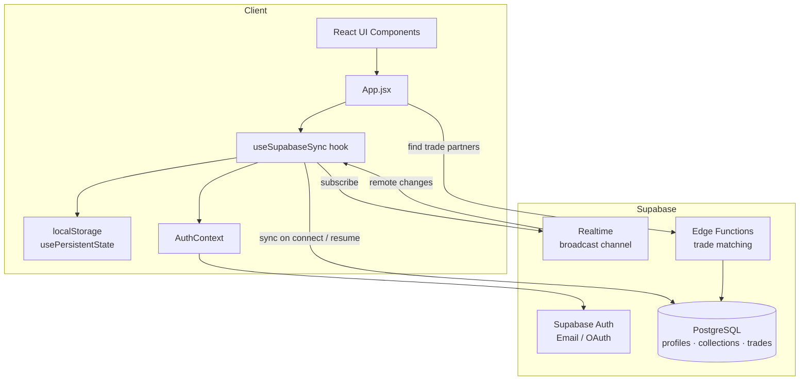
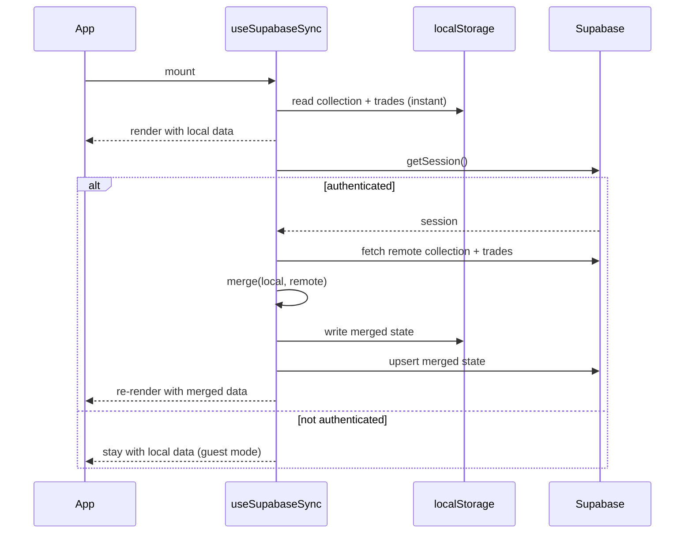
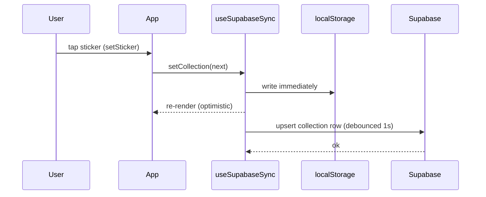
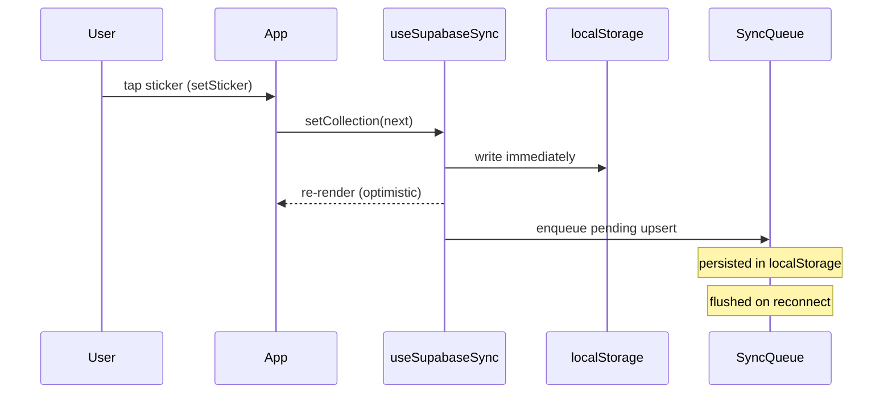
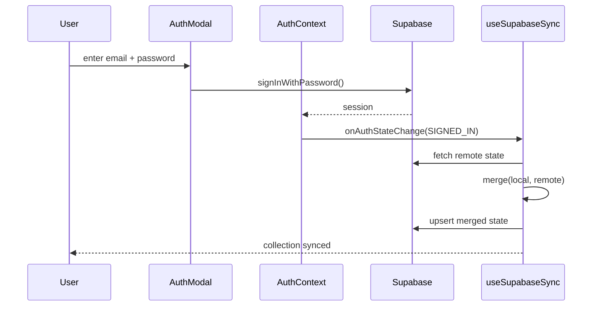

# Design Document: Database Integration

## Overview

Mi Pana currently stores all user data (sticker collection and trade proposals) exclusively in `localStorage` via the `usePersistentState` hook. This feature replaces that single-device, ephemeral store with a Supabase-backed persistence layer that supports user accounts, cross-device sync, reliable backup, and real-user trade matching — while keeping the app fully functional offline via an offline-first architecture where `localStorage` remains the primary read/write store and Supabase acts as the sync layer.

The integration is designed to be minimally invasive: the existing `collection` / `trades` state shape and all downstream components remain unchanged. A new `useSupabaseSync` hook wraps `usePersistentState` and handles auth state, conflict resolution, and background sync transparently.

---

## Architecture



---

## Sequence Diagrams

### App Startup & Sync



### Sticker Update (Online)



### Sticker Update (Offline)



### Sign-In & Data Migration



---

## Components and Interfaces

### AuthContext

**Purpose**: Provides session state and auth actions to the entire component tree.

**Interface**:
```typescript
interface AuthContextValue {
  session: Session | null          // Supabase session object
  user: User | null                // shorthand for session?.user
  isLoading: boolean               // true during initial session check
  signIn(email: string, password: string): Promise<AuthError | null>
  signUp(email: string, password: string, username: string): Promise<AuthError | null>
  signOut(): Promise<void>
  signInWithOAuth(provider: 'google'): Promise<void>
}
```

**Responsibilities**:
- Wrap the app in `<AuthContext.Provider>`
- Call `supabase.auth.getSession()` on mount
- Subscribe to `onAuthStateChange` and expose current session
- Expose sign-in / sign-up / sign-out helpers

---

### useSupabaseSync hook

**Purpose**: Drop-in replacement for `usePersistentState` that adds Supabase sync on top of localStorage.

**Interface**:
```typescript
function useSupabaseSync<T>(
  key: string,
  defaultValue: T,
  options?: SyncOptions
): [T, Dispatch<SetStateAction<T>>, SyncStatus]

interface SyncOptions {
  debounceMs?: number      // default 1000
  mergeStrategy?: 'local-wins' | 'remote-wins' | 'merge-fn'
  mergeFn?: (local: T, remote: T) => T
}

type SyncStatus = 'idle' | 'syncing' | 'error' | 'offline'
```

**Responsibilities**:
- Read initial state from localStorage (synchronous, no flicker)
- When authenticated and online: fetch remote state, merge, write back
- Debounce writes to Supabase to avoid excessive RPCs
- Enqueue writes to a `pendingSyncs` queue when offline
- Flush queue on reconnect (`window` online event)
- Expose `SyncStatus` for UI indicators

---

### SyncQueue

**Purpose**: Persists pending Supabase writes across page reloads when offline.

**Interface**:
```typescript
interface SyncQueueEntry {
  id: string           // uuid
  table: string        // 'collections' | 'trades'
  userId: string
  payload: unknown
  enqueuedAt: string   // ISO timestamp
}

interface SyncQueue {
  enqueue(entry: Omit<SyncQueueEntry, 'id' | 'enqueuedAt'>): void
  flush(supabase: SupabaseClient): Promise<void>
  clear(): void
  size(): number
}
```

**Responsibilities**:
- Persist queue entries in `localStorage` under key `panini2026-sync-queue`
- On `flush()`: attempt each entry in order; remove on success; keep on failure
- Deduplicate by `(table, userId)` — only keep the latest entry per key

---

### TradeMatchingService

**Purpose**: Replaces mock trade data with real user discovery via Supabase.

**Interface**:
```typescript
interface TradeMatch {
  userId: string
  username: string
  canGive: string[]    // sticker IDs I can give them
  canGet: string[]     // sticker IDs they can give me
  score: number        // canGive.length + canGet.length
}

interface TradeMatchingService {
  findMatches(myCollection: Collection): Promise<TradeMatch[]>
  publishCollection(userId: string, collection: Collection): Promise<void>
}
```

**Responsibilities**:
- Call a Supabase Edge Function `match-trades` that queries other users' collections
- Return ranked matches sorted by `score` descending
- `publishCollection` upserts the user's duplicate/needs bitmaps for discovery

---

### AuthModal (UI Component)

**Purpose**: Sign-in / sign-up modal, shown when user taps a "Sync" or "Sign in" CTA.

**Interface**:
```typescript
interface AuthModalProps {
  isOpen: boolean
  onClose(): void
  initialMode?: 'sign-in' | 'sign-up'
}
```

**Responsibilities**:
- Email + password form with validation
- Google OAuth button
- Switch between sign-in and sign-up modes
- Show loading and error states

---

## Data Models

### Supabase Schema

#### `profiles`
```sql
create table profiles (
  id          uuid primary key references auth.users(id) on delete cascade,
  username    text not null unique,
  created_at  timestamptz default now()
);
```

#### `collections`
```sql
create table collections (
  id          uuid primary key default gen_random_uuid(),
  user_id     uuid not null references profiles(id) on delete cascade,
  sticker_id  text not null,          -- e.g. 'ARG-01'
  quantity    smallint not null default 1 check (quantity >= 0),
  updated_at  timestamptz default now(),
  unique (user_id, sticker_id)
);
```

> Storing one row per sticker (normalized) rather than a JSON blob enables efficient querying for trade matching without loading full collections into memory.

#### `trades`
```sql
create table trades (
  id          uuid primary key default gen_random_uuid(),
  user_id     uuid not null references profiles(id) on delete cascade,
  can_give    text[] not null,         -- sticker IDs
  can_get     text[] not null,
  created_at  timestamptz default now(),
  status      text not null default 'open' check (status in ('open','accepted','rejected'))
);
```

#### `collection_snapshots` (for trade matching)
```sql
create table collection_snapshots (
  user_id      uuid primary key references profiles(id) on delete cascade,
  dup_bitmap   bytea not null,         -- 108-byte bitmap (reuses qrCodec format)
  need_bitmap  bytea not null,
  updated_at   timestamptz default now()
);
```

> Bitmaps reuse the exact encoding from `qrCodec.js` — no new serialization logic needed.

### Client-Side State Shape (unchanged)

```typescript
// Unchanged — all existing components continue to work
type Collection = Record<string, number>   // { 'ARG-01': 2, 'BRA-05': 1, ... }

interface Trade {
  id: number
  createdAt: string
  canGive: string[]
  canGet: string[]
}
```

---

## Algorithmic Pseudocode

### Merge Algorithm (collection)

```pascal
ALGORITHM mergeCollections(local, remote)
INPUT:  local  — Collection from localStorage
        remote — Collection from Supabase
OUTPUT: merged — Collection (union, taking max quantity per sticker)

BEGIN
  merged ← {}

  FOR each (stickerId, qty) IN local DO
    merged[stickerId] ← qty
  END FOR

  FOR each (stickerId, remoteQty) IN remote DO
    localQty ← merged[stickerId] OR 0
    merged[stickerId] ← MAX(localQty, remoteQty)
  END FOR

  RETURN merged
END
```

**Preconditions:**
- `local` and `remote` are valid Collection objects (may be empty)

**Postconditions:**
- Every sticker present in either input appears in `merged`
- `merged[id] = MAX(local[id] ?? 0, remote[id] ?? 0)` for all `id`
- No sticker is lost; no quantity is reduced

**Rationale**: Taking the maximum is safe for a sticker collection — a user who marked a sticker on one device and deleted it on another most likely made a mistake on the deletion side. This is revisable if the user explicitly wants "remote-wins" semantics.

---

### SyncQueue Flush Algorithm

```pascal
ALGORITHM flushSyncQueue(queue, supabaseClient)
INPUT:  queue          — ordered list of SyncQueueEntry
        supabaseClient — authenticated Supabase client
OUTPUT: (side effects only)

BEGIN
  FOR each entry IN queue DO
    TRY
      IF entry.table = 'collections' THEN
        supabaseClient.upsert('collections', entry.payload)
      ELSE IF entry.table = 'trades' THEN
        supabaseClient.upsert('trades', entry.payload)
      END IF
      queue.remove(entry)
    CATCH networkError
      BREAK  // stop on first failure; retry on next reconnect
    END TRY
  END FOR

  persistQueue(queue)
END
```

**Preconditions:**
- `supabaseClient` has a valid authenticated session
- Network is available (called only on `window` online event)

**Postconditions:**
- All successfully flushed entries are removed from the queue
- Queue is persisted to localStorage after each successful removal
- On network failure, remaining entries stay in queue for next flush

**Loop Invariants:**
- All entries processed before the current one have been successfully synced and removed
- Queue length is non-increasing throughout the loop

---

### Trade Match Scoring (Edge Function)

```pascal
ALGORITHM scoreTradeMatch(myDupBitmap, myNeedBitmap, theirDupBitmap, theirNeedBitmap)
INPUT:  my/their dup and need bitmaps (108 bytes each)
OUTPUT: score — integer ≥ 0, canGive list, canGet list

BEGIN
  canGive ← bitmapAND(myDupBitmap, theirNeedBitmap)   // I have dups they need
  canGet  ← bitmapAND(theirDupBitmap, myNeedBitmap)   // they have dups I need
  score   ← popcount(canGive) + popcount(canGet)
  RETURN { score, canGive, canGet }
END
```

**Preconditions:**
- All bitmaps are exactly 108 bytes (BYTES_PER_MAP from qrCodec.js)

**Postconditions:**
- `score ≥ 0`
- `canGive` contains only sticker IDs where I have ≥2 AND they have 0
- `canGet` contains only sticker IDs where they have ≥2 AND I have 0

---

## Key Functions with Formal Specifications

### `useSupabaseSync(key, defaultValue, options)`

**Preconditions:**
- `key` is a non-empty string matching an existing localStorage key convention
- `defaultValue` is a valid serializable value

**Postconditions:**
- Returns `[state, setState, syncStatus]`
- `state` is always initialized from localStorage synchronously (no loading flicker)
- When authenticated and online, `state` converges to `merge(local, remote)` within one render cycle after mount
- `setState` writes to localStorage immediately and enqueues a debounced Supabase upsert

---

### `SyncQueue.flush(supabaseClient)`

**Preconditions:**
- `supabaseClient.auth.getSession()` returns a valid session
- `navigator.onLine === true`

**Postconditions:**
- All entries that were successfully upserted are removed from the queue
- Queue is persisted to localStorage after each removal
- If any entry fails, the loop stops and remaining entries are preserved

---

### `mergeCollections(local, remote)`

**Preconditions:**
- Both arguments are `Record<string, number>` (may be `{}`)

**Postconditions:**
- Result contains every key from both inputs
- `result[k] = Math.max(local[k] ?? 0, remote[k] ?? 0)` for all `k`
- Input objects are not mutated

---

## Example Usage

### Replacing `usePersistentState` in App.jsx

```typescript
// Before
const [collection, setCollection] = usePersistentState('panini2026-collection', {});
const [trades, setTrades] = usePersistentState('panini2026-trades', []);

// After — drop-in replacement, same API + sync status
const [collection, setCollection, collectionSyncStatus] = useSupabaseSync(
  'panini2026-collection',
  {},
  { mergeFn: mergeCollections }
);
const [trades, setTrades, tradesSyncStatus] = useSupabaseSync(
  'panini2026-trades',
  []
);
```

### Auth flow in App.jsx

```typescript
const { user, isLoading } = useAuth();

// Guest mode: app works exactly as before
// Authenticated: sync runs automatically in useSupabaseSync
```

### Finding real trade matches

```typescript
const matches = await tradeMatchingService.findMatches(collection);
// Returns TradeMatch[] sorted by score desc
// Replaces MOCK_MATCHES in TradeMatchesScreen
```

---

## Correctness Properties

*A property is a characteristic or behavior that should hold true across all valid executions of a system — essentially, a formal statement about what the system should do. Properties serve as the bridge between human-readable specifications and machine-verifiable correctness guarantees.*

### Property 1: Guest mode uses only localStorage

For any key/value pair and any sequence of `setState` calls while no Supabase session exists, `useSupabaseSync` SHALL read and write exclusively from localStorage and SHALL NOT make any Supabase network requests or enqueue any SyncQueue entries.

**Validates: Requirements 1.1, 1.4, 12.3**

---

### Property 2: Synchronous initialization from localStorage

For any key with a pre-existing value in localStorage, `useSupabaseSync` SHALL return that value as the initial state synchronously on mount, before any Supabase network call completes.

**Validates: Requirements 4.2, 9.1**

---

### Property 3: setState writes to localStorage immediately

For any new state value passed to the `setState` function returned by `useSupabaseSync`, the value SHALL be written to localStorage before the next render cycle, regardless of network or auth state.

**Validates: Requirements 4.4**

---

### Property 4: Offline writes are enqueued, not dropped

For any `setState` call made while the user is authenticated but `navigator.onLine === false`, a SyncQueueEntry SHALL be created in the SyncQueue and persisted to localStorage, and no Supabase upsert SHALL be attempted.

**Validates: Requirements 4.6, 5.1**

---

### Property 5: Custom mergeFn is always applied

For any `mergeFn` provided in `SyncOptions` and any pair of local and remote state values, `useSupabaseSync` SHALL pass both values to `mergeFn` and use its return value as the merged state.

**Validates: Requirements 4.8**

---

### Property 6: Merged state is written to both stores

For any local state and remote state that differ, after `useSupabaseSync` completes its post-mount sync, the merged result SHALL be present in both localStorage and the Supabase `collections` table.

**Validates: Requirements 9.3**

---

### Property 7: mergeCollections — no data loss (max-wins)

For any two valid Collections `A` and `B` and any sticker ID `id`, `mergeCollections(A, B)[id]` SHALL equal `Math.max(A[id] ?? 0, B[id] ?? 0)`, and every sticker ID present in either `A` or `B` SHALL appear in the result.

**Validates: Requirements 6.2, 6.3**

---

### Property 8: mergeCollections — commutativity

For any two valid Collections `A` and `B`, `mergeCollections(A, B)` SHALL produce a result equal to `mergeCollections(B, A)`.

**Validates: Requirements 6.6**

---

### Property 9: mergeCollections — idempotency

For any valid Collection `A`, `mergeCollections(A, A)` SHALL produce a result equal to `A`.

**Validates: Requirements 6.5**

---

### Property 10: mergeCollections — no mutation

For any two valid Collections `A` and `B`, calling `mergeCollections(A, B)` SHALL NOT modify the contents of `A` or `B`.

**Validates: Requirements 6.4**

---

### Property 11: SyncQueue deduplication

For any `(table, userId)` pair, enqueueing two entries with the same pair SHALL result in exactly one entry in the queue, containing the data from the second enqueue call.

**Validates: Requirements 5.3**

---

### Property 12: SyncQueue size invariant

For any sequence of `enqueue` and successful `flush` operations, `SyncQueue.size()` SHALL equal the number of entries enqueued minus the number successfully flushed.

**Validates: Requirements 5.7**

---

### Property 13: SyncQueue flush persists state

For any queue state after a `flush` call completes, the contents of `localStorage['panini2026-sync-queue']` SHALL exactly match the in-memory queue (entries that failed or were not yet processed remain; successfully flushed entries are absent).

**Validates: Requirements 5.6**

---

### Property 14: Bitmap round-trip preserves sticker sets

For any valid Collection, encoding the duplicate sticker IDs and needs sticker IDs into bitmaps and then decoding those bitmaps SHALL produce the same sets of sticker IDs as the original Collection, and each bitmap SHALL be exactly 108 bytes.

**Validates: Requirements 10.3, 10.4, 10.5**

---

### Property 15: Trade match scoring correctness

For any pair of user bitmaps (caller and candidate), `canGive` SHALL contain exactly the sticker IDs present in both the caller's duplicate bitmap and the candidate's needs bitmap, `canGet` SHALL contain exactly the sticker IDs present in both the candidate's duplicate bitmap and the caller's needs bitmap, and `score` SHALL equal `canGive.length + canGet.length`.

**Validates: Requirements 8.2, 8.3, 8.4**

---

### Property 16: Trade match results are sorted by score

For any list of TradeMatch objects returned by `TradeMatchingService.findMatches`, the list SHALL be sorted in descending order by `score`.

**Validates: Requirements 8.2**

---

### Property 17: Realtime merge applies correctly

For any remote state change received via the Supabase Realtime channel while authenticated, `useSupabaseSync` SHALL merge the remote state with the current local state using the configured merge strategy and update the UI state accordingly.

**Validates: Requirements 12.2**

---

## Error Handling

### Auth Errors

| Condition | Response | Recovery |
|-----------|----------|----------|
| Invalid credentials | Show inline error in AuthModal | User retries |
| Network unavailable during sign-in | Show "offline" toast | Retry when online |
| Session expired | Silent re-auth attempt; if fails, show sign-in prompt | User signs in again |

### Sync Errors

| Condition | Response | Recovery |
|-----------|----------|----------|
| Supabase upsert fails (network) | Enqueue to SyncQueue; show `syncStatus = 'error'` indicator | Auto-retry on reconnect |
| Supabase upsert fails (auth) | Clear queue entry; show sign-in prompt | User re-authenticates |
| Merge conflict (both sides modified) | Apply `mergeCollections` (max-wins) | Automatic |
| localStorage quota exceeded | Log warning; skip local write; sync directly | Graceful degradation |

### Trade Matching Errors

| Condition | Response | Recovery |
|-----------|----------|----------|
| Edge Function timeout | Return empty matches array; show "try again" | User retries |
| User has no duplicates | Return empty matches with explanatory message | User collects more stickers |

---

## Testing Strategy

### Unit Testing Approach

- `mergeCollections`: property-based tests covering commutativity, idempotency, and no-data-loss invariants
- `SyncQueue`: test enqueue/dequeue/flush/deduplication logic with mocked Supabase client
- `useSupabaseSync`: test with mocked Supabase and localStorage; verify offline queue behavior

### Property-Based Testing Approach

**Property Test Library**: `fast-check`

Key properties to test:
- `mergeCollections(A, B)[id] >= A[id]` for all `id` in `A` (no quantity reduction)
- `mergeCollections(A, B) === mergeCollections(B, A)` (commutativity)
- `mergeCollections(A, A) === A` (idempotency)
- Bitmap encode → decode round-trip preserves sticker sets (reuses existing qrCodec tests)

### Integration Testing Approach

- Use Supabase local dev stack (`supabase start`) for integration tests
- Test full sign-up → sync → sign-out → sign-in → data restored flow
- Test offline → online transition with pending queue flush

---

## Performance Considerations

- **Debounced writes**: Supabase upserts are debounced by 1 second to batch rapid sticker taps (e.g., incrementing a sticker multiple times quickly)
- **Normalized collection table**: Querying for trade matches operates on bitmaps (108 bytes per user), not full collection rows — O(1) per user comparison
- **Lazy auth**: Session check is async and non-blocking; UI renders from localStorage immediately
- **Realtime opt-in**: Supabase Realtime subscription is only established when the user is authenticated; guests incur no WebSocket overhead

---

## Security Considerations

- **Row-Level Security (RLS)**: All Supabase tables have RLS enabled. Users can only read/write their own `collections` and `trades` rows. The `collection_snapshots` table is readable by all authenticated users (needed for trade matching) but writable only by the owner.
- **Auth tokens**: Supabase JWTs are stored in `localStorage` by the Supabase client SDK — consistent with the app's existing localStorage-first approach.
- **Edge Function auth**: The `match-trades` Edge Function validates the caller's JWT before querying other users' snapshots.
- **No PII in QR codes**: The existing QR encoding contains only sticker bitmaps, no user identity — this is preserved.

---

## Dependencies

| Dependency | Purpose | Notes |
|------------|---------|-------|
| `@supabase/supabase-js` | Supabase client SDK | Auth, DB, Realtime |
| `fast-check` | Property-based testing | Dev dependency |
| Supabase project | Hosted Postgres + Auth + Edge Functions | Free tier sufficient for MVP |
